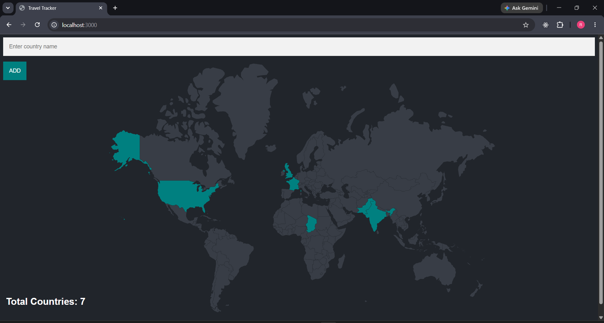
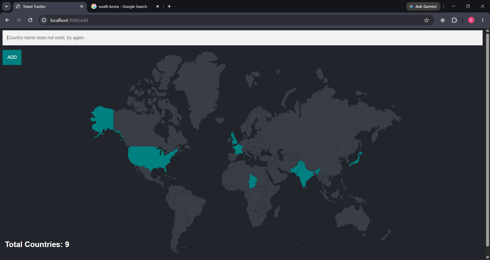

# 🌍 Family Travel Tracker
 
A web application that lets you track visited countries on an interactive world map. Type a country name, hit Add, and watch it light up in teal on the SVG map — with a live counter of total countries visited.
 
---
 
## ✨ Features & How Each Part Works
 
### 🗺️ Interactive SVG World Map
The entire world map is rendered as inline SVG directly in `index.ejs`. Every country has a unique `<path>` element with its **ISO 2-letter country code** as the HTML `id` (e.g., `id="IN"` for India, `id="US"` for USA).
 
On page load, a JavaScript snippet runs:
```js
const country_codes = "<%= countries %>".split(",");
country_codes.forEach(code => {
  const countryPath = document.getElementById(cleanCode);
  if (countryPath) {
    countryPath.style.fill = 'teal';  // Highlights visited country
  }
});
```
EJS injects the country codes from the database → JS splits them → finds matching SVG `<path>` by id → sets fill to `teal`.
 
---
 
### ➕ Add a Country
The form at the top sends a **POST** request to `/add` with the typed country name.
 
**What happens in the backend:**
```
User types "india"
    ↓
SQL: SELECT country_code FROM countries
     WHERE LOWER(country_name) LIKE '%india%'
    ↓
Gets country_code → e.g., "IN"
    ↓
SQL: INSERT INTO visited_countries (country_code) VALUES ('IN')
    ↓
Redirect to "/" → map re-renders with IN highlighted
```
 
- **Partial + Case-insensitive search:** Typing "ind" will still match "India" because of `LIKE '%' || $1 || '%'`
- **Duplicate protection:** If the country code is already in `visited_countries`, PostgreSQL throws a unique constraint error — caught and handled
---
 
### ⚠️ Error Handling
Two error cases are handled and shown directly in the input placeholder:
 
| Error | Cause | Placeholder Message |
|-------|-------|---------------------|
| Country not found | Name doesn't match any row in `countries` table | `"Country name does not exist, try again."` |
| Already added | Country code already in `visited_countries` | `"Country has already been added, try again."` |
 
In EJS this works via:
```ejs
placeholder="<%= locals.error ? error : 'Enter country name' %>"
```
If `error` variable exists → shows it as placeholder. Otherwise shows default hint.
 
---
 
### 🔢 Live Country Counter
The total number of visited countries is passed from server to EJS:
```js
res.render("index.ejs", { countries: countries, total: countries.length });
```
Rendered at the bottom-left of the page:
```ejs
<h2 class="total-count">Total Countries: <%=total%></h2>
```
 
---
 
### 🎨 Styling & Theme
- **Dark theme:** Background `#21252b`, text `#d3ddef`
- **Default map color:** `#383d46` (dark gray for unvisited countries)
- **Visited country color:** `teal`
- **Smooth transitions:** `transition: 0.5s` on SVG paths for color change effect
- **Fully responsive:** Media query at `max-width: 767px` adjusts map layout for mobile
---
 
## 🛠️ Tech Stack
 
| Layer | Technology |
|-------|-----------|
| Backend | Node.js, Express.js |
| Database | PostgreSQL |
| Frontend | EJS Templating, Vanilla JavaScript |
| Styling | Custom CSS (Responsive) |
| Map | Inline SVG (World Map with ISO path IDs) |
| Form Parsing | body-parser |
 
---
 
## 🗄️ Database Schema
 
```sql
-- Stores all world countries with their ISO codes
CREATE TABLE countries (
  id SERIAL PRIMARY KEY,
  country_code VARCHAR(10) NOT NULL,
  country_name VARCHAR(100) NOT NULL
);
 
-- Stores visited countries
CREATE TABLE visited_countries (
  id SERIAL PRIMARY KEY,
  country_code VARCHAR(10) UNIQUE NOT NULL
);
```
 
> **Note:** `UNIQUE` constraint on `country_code` in `visited_countries` prevents duplicate entries automatically.
 
---
 
## 📁 Project Structure
 
```
Family-Travel-Tracker/
├── index.js              # Express server — routes and DB logic
├── views/
│   └── index.ejs         # EJS template — SVG map + form + JS
├── styles/
│   └── main.css          # Dark theme + map styling + responsive
├── public/               # Static files
└── package.json
```
 
---
 
## ⚙️ How It Works — Request Flow
 
```
Browser                    Express Server              PostgreSQL
  |                              |                          |
  |--- GET /  ----------------> |                          |
  |                              |--- SELECT country_code  |
  |                              |    FROM visited_countries|
  |                              |<-- [IN, US, FR, ...]    |
  |<-- index.ejs rendered with--|                          |
  |    countries + total         |                          |
  |                              |                          |
  |--- POST /add (country=india) |                          |
  |                              |--- SELECT country_code  |
  |                              |    WHERE name LIKE india |
  |                              |<-- IN                    |
  |                              |--- INSERT INTO visited  |
  |                              |<-- success / error       |
  |<-- redirect to /  ----------|                          |
```
 
---
 
## 🔧 Setup & Run Locally
 
**1. Clone the repository**
```bash
git clone https://github.com/rahulpawar-o7/Family-Travel-Tracker.git
cd Family-Travel-Tracker
```
 
**2. Install dependencies**
```bash
npm install
```
 
**3. Set up PostgreSQL database**
```sql
-- Create database
CREATE DATABASE world_travel;
 
-- Create tables
CREATE TABLE countries (
  id SERIAL PRIMARY KEY,
  country_code VARCHAR(10) NOT NULL,
  country_name VARCHAR(100) NOT NULL
);
 
CREATE TABLE visited_countries (
  id SERIAL PRIMARY KEY,
  country_code VARCHAR(10) UNIQUE NOT NULL
);
 
-- Import countries data (CSV file with all world countries)
-- COPY countries FROM '/path/to/countries.csv' DELIMITER ',' CSV HEADER;
```
 
**4. Update DB credentials in `index.js`**
```js
const db = new pg.Client({
  user: "your_postgres_user",
  host: "localhost",
  database: "your_database_name",
  password: "your_password",
  port: 5432,
});
```
 
**5. Run the server**
```bash
node index.js
```
 
Open `http://localhost:3000`
 
---
 
## 📸 Screenshots
 
<!-- Add screenshots after pushing -->


 
---
 
## 💼 Key Logic Highlights
 
- **`checkVisisted()` function** — async function that queries DB and returns array of country codes
- **Partial name search** — `LIKE '%india%'` means user doesn't need to type exact name
- **SVG path mapping** — ISO country codes as HTML IDs directly link DB data to map visuals
- **Inline JS in EJS** — Server data passed directly into client-side JavaScript via EJS tags
---
 
## 👤 Author
 
**Rahul Pawar**
- GitHub: [@rahulpawar-o7](https://github.com/rahulpawar-o7)
- LinkedIn: [Rahul Pawar](https://www.linkedin.com/in/rahul-pawar-a09404358)
 
